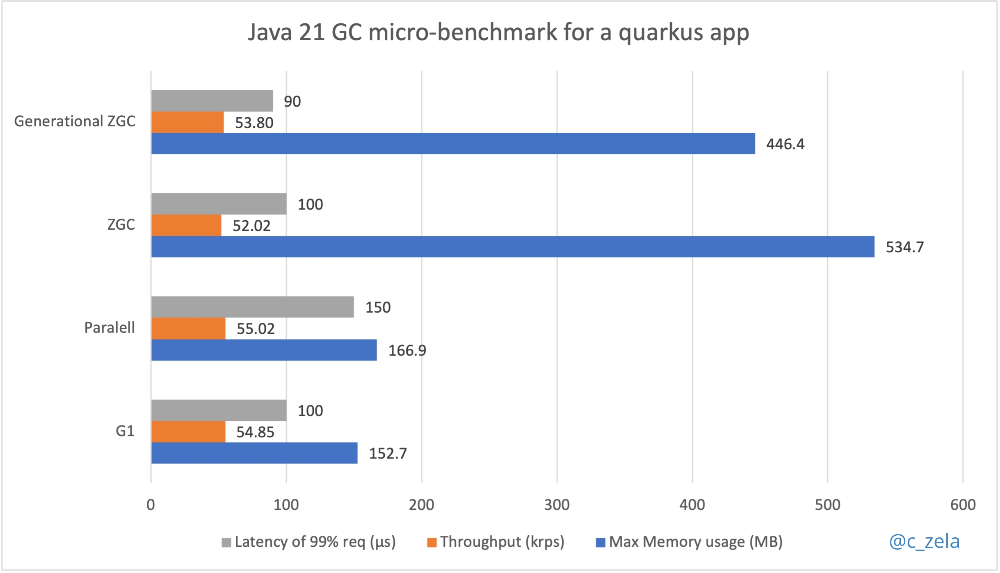

# Micro-benchmark del rendimiento de GCs en Java 21 [en español]

Hola!

Con el lanzamiento de `java` 21 tuve la curiosidad de evaluar el rendimiento de 4 implementaciones diferentes de `garbage collector`, en adelante GC, y [las mejoras que estas tienen en Java 21](https://www.youtube.com/watch?v=LXWbyf8SUjI). Mi prueba consistió en enviar 1MM de solicitudes sostenidas en 3 repeticiones a un microservicio sin estado basado en `quarkus` (no hay ninguna razón especial por la que haya usado quarkus, simplemente ya tenía la aplicacion y lo tomé de ejemplo).

Antes que decidas utilizar uno u otro GC vamos a hacer una breve introducción de que es el GC en términos simples y porque es importante saber cuál su papel en el rendimiento de tu aplicación.

## Introducción al GC
El GC es el mecanismo que tiene la JVM para poder destruir objectos creados por tu aplicación de forma automática. Derrepente si has programado en lenguajes de antaño como C o C++ parte de tu rutina de programación era destruir el objeto cuando ya cumplía su función. En `java` ese trabajo lo hace el GC por ti, con el fin de liberar el espacio de memoria asignada al `Heap` para que haya disponibilidad de memoria y asi alojar más objetos que tu aplicación cree en tiempo de ejecución sin que se quede sin memoria, sí el famoso `OutOfMemory Exception`. El gran trabajo que hace el GC (y que muchas veces no es reconocido) es que tu aplicación continúe `uptime` y no se quede sin recursos, aunque a veces pasa una paradoja donde el GC es el que se consume los recursos de computo y tu aplicación no puede ejecutarse correctamente y hace `crash` pero esto en el 99.99% de los casos es por una mal `tunning` del GC o la elección inadecuada del GC para tu tipo de aplicación java.

### ¿Porque siguen implementando más GCs?
A lo largo del tiempo que java ha estado introduciendo mas versiones y [mas features](https://openjdk.org/projects/jdk/21/), también surgen más patrones de arquitectura y  plataformas en el mundo del desarrollo de aplicaciones java que generan nuevos escenarios de rendimiento y ejecución. Para cubrir esos escenarios, se proponen más implementaciones de GC para alinear la JVM al ecosistema que impone el mercado. De esta manera se aceptan más implementaciones de GC bajo un propósito de uso y rendimiento. 

Cuando un GC alcanza la madurez y adopción en el mercado se vuelve el GC por `default` para versiones venideras.

Entonces la pregunta viene de inmediato, ¿Es la versión mas reciente la mejor? Por lo que ya acabamos de explicar, la respuesta es un NO NECESARIAMENTE. La recomendación de siempre ha sido, es y será: escoge el GC más adecuado para el comportamiento y arquitectura de tu aplicación ya que cada GC tiene un propósito diferente y es más eficiente para ciertas cargas y no tan eficiente para otras.

Aprende mas del GC en este [link](https://dev.java/learn/jvm/tool/garbage-collection/)

## La aplicacion en prueba, un sample de quarkus.
Desarrollar microservicios ya se ha convertido en el desarrollo normal de hoy en dia de tal manera que los frameworks de java mas populares del mercado buscan ser mas ligeros, reducir el footprint (consumo de CPU, memory) y soportar mayor throughput (transacciones por segundo) con una menor latencia (aka, tiempo de respuesta). Bajo estas premisas se estan desarrollando tecnologías que contribuyan a dichas premisas y se puedan desplegar en ambientes elásticos como la nube de manera costo-eficiente. 

En esta ocasión, utilizaremos quarkus para desarrollar en Rest API que nos devuelva el objeto "community" que tiene como atributos un `String name` y una lista de miembros `List<String> members`. Super simple.


## Micro-benchmarks 
La manera mas fácil para utilizar diferentes distribuciones de Java es usando [SDKMAN](https://sdkman.io/).

Este benchmark ha utilizado GraalVM CE for JDK 21 
```
> sdk install java 21-graalce
---
OpenJDK 64-Bit Server VM GraalVM CE 21+35.1 (build 21+35-jvmci-23.1-b15, mixed mode, sharing)
```
.. y ha sido ejecutado en una MacBook Pro M2 Chip `MacBook-Pro 22.5.0 Darwin Kernel Version 22.5.0...RELEASE_ARM64_T8112 arm64` de CPU `8-Core`, Memoria fisica de `8GB`



- _Latencia medida en microsegundos (μs) 1/1,000,000 de segundo_

- _Throughput en miles de request por segundo (kprs)_

- _Memory Usage en Megabytes (MB)_


Este micro-benchmark ha puesto a prueba 4 implementaciones de GCs usando sus configuraciones por defecto (sin tunning) para seleccionar cuál es más eficiente para un microservicio, recordemos la [definicion de microservicio](https://www.vmware.com/es/topics/glossary/content/microservices.html) y veremos que una de sus principales caracteristicas es ofrecer una mayor disponibilidad y escalamiento.

Existen GC de distintos tipos, estan los concurrentes, los basados en threads, los que buscan un mejor equilibrio entre throughput y latencia, etc. Bajo esa misma perspectiva evaluamos estos 4 (el generational ZGC fue incluida porque es la última implementación liberada en Java 21 y despertó mi curiosidad):
- [`ParallelGC`](https://inside.java/2022/08/01/sip062/): Es el que te ofrece el mayor throughput posible utilizando multiples threads, pero esto tiene el costo de tiempos de pausa y uso de memoria. Es un GC multi-generacional (almacena objetos jovenes y viejos).

    Ejecución:

    ```shell
    $ java -verbose:gc -XX:+UseParallelGC -jar quarkus-aot-sample/target/quarkus-aot-sample.jar &

    OpenJDK 64-Bit Server VM GraalVM CE 21+35.1 (build 21+35-jvmci-23.1-b15, mixed mode, sharing)
    [0.023s][info][gc] Using Parallel
    ...
    ```
    Corremos de forma consecutiva 3 repiticiones de la misma carga
    ```
    # Run 1
    $ hey -z 20s -c 4 http://localhost:8080/community & ./print-stats.sh

    # Run 2.. Run 3
    ...
    ```
    Esta configuración generaría 1MM de solicitudes en 20 segundos de forma distribuida con 4 workers por corrida.


    Resultado final:
    ```
    # GC Log
    [71.552s][info][gc] GC(571) Pause Young (Allocation Failure) 33M->10M(109M) 0.177ms

    # Throughput
    Requests/sec: 55019.2703

    # Latencia del 99% de solicitudes
    Latency 99% in 0.00015 secs

    # Consumo de memoria
    PID 4936: RSS 166.9M

    ```

- [`G1GC`](https://inside.java/2022/06/20/sip056/): Ofrece un mayor balance entre un alto throughput y latencia y tiene tiempos de pausa de corta duracion ya que corre en paralelo con la aplicacion. Tambien utiliza multiples threads y ofrece mayor previsibilidad. Es el GC por default y es un GC multi-generacional.

    Ejecución
    ```shell
    $ java -verbose:gc -jar quarkus-aot-sample/target/quarkus-aot-sample.jar &

    OpenJDK 64-Bit Server VM GraalVM CE 21+35.1 (build 21+35-jvmci-23.1-b15, mixed mode, sharing)
    [0.021s][info][gc] Using G1
    ...
    ```
    Corremos de forma consecutiva 3 repiticiones de la misma carga
    ```
    # Run 1
    $ hey -z 20s -c 4 http://localhost:8080/community & ./print-stats.sh

    # Run 2.. Run 3
    ...
    ```
    Esta configuracion generaria 1MM de solicitudes en 20 segundos de forma distribuida con 4 workers por corrida.


    Resultado final:

    ```
    # GC Log
    [69.358s][info][gc] GC(569) Pause Young (Normal) (G1 Evacuation Pause) 34M->10M(43M) 0.372ms

    # Throughput
    Requests/sec: 54851.1193

    # Latencia del 99% de solicitudes
    Latency 99% in 0.0001 secs

    # Consumo de memoria
    PID 5695: RSS 152.7M

    ```
- [`ZGC`](https://inside.java/2022/05/30/sip053/): Diseñada para ofrecer una baja latencia y llegar a altos numeros de escalamiento en el tamano del Heap (soporta hasta 16TBs). Sus tiempos de pausa son muy cortos (microsegundos) pero ofrece un menor throughput que las anteriores. Es un GC de una sola generacion (objetos viejos).

    Ejecución:

    ```shell
    $ java -verbose:gc -XX:+UseZGC -jar quarkus-aot-sample/target/quarkus-aot-sample.jar &

    OpenJDK 64-Bit Server VM GraalVM CE 21+35.1 (build 21+35-jvmci-23.1-b15, mixed mode, sharing)
    [0.014s][info][gc] Using The Z Garbage Collector
    ...
    ```
    Corremos de forma consecutiva 3 repiticiones de la misma carga
    ```
    # Run 1
    $ hey -z 20s -c 4 http://localhost:8080/community & ./print-stats.sh

    # Run 2.. Run 3
    ...
    ```
    Esta configuración generaría 1MM de solicitudes en 20 segundos de forma distribuida con 4 workers por corrida.


    Resultado final:

    ```
    # GC Log
    [58.771s][info][gc] GC(32) Garbage Collection (Proactive) 358M(17%)->50M(2%)

    # Throughput
    Requests/sec: 52018.1103

    # Latencia del 99% de solicitudes
    Latency 99% in 0.0001 secs

    # Consumo de memoria
    PID 94408: RSS 534.7M

    ```

- [`Generational ZGC` - introducido en Java 21](https://openjdk.org/jeps/439): Ofrece todas las ventajas del ZGC ya que esta basada en ella pero agrega la capacidad de ser  multi-generacional diviendo el espacio del Heap para soportar objetos jovenes y viejos resultado en un mayor throughput con menor consumo de memoria que el ZGC.

    Ejecución:

    _Nota que en la tercera linea del log la JVM desactiva automáticamente el compilador de GraalVM (JVMCI) ya que este aun no soporta Generational ZGC, pero podemos usar Java 21 de igual manera._

    ```shell
    $ java -verbose:gc -XX:+UseZGC -XX:+ZGenerational -jar quarkus-aot-sample/target/quarkus-aot-sample.jar &

    OpenJDK 64-Bit Server VM GraalVM CE 21+35.1 (build 21+35-jvmci-23.1-b15, mixed mode, sharing)
    [0.003s][warning][gc,jvmci] Setting EnableJVMCI to false as selected GC does not support JVMCI: z gc
    [0.006s][info   ][gc      ] Using The Z Garbage Collector
    ...
    ```
    Corremos de forma consecutiva 3 repiticiones de la misma carga
    ```
    # Run 1
    $ hey -z 20s -c 4 http://localhost:8080/community & ./print-stats.sh

    # Run 2.. Run 3
    ...
    ```
    Esta configuración generaría 1MM de solicitudes en 20 segundos de forma distribuida con 4 workers por corrida.


    Resultado final:

    ```
    # GC Log
    [107.288s][info   ][gc      ] GC(11) Major Collection (Proactive) 732M(36%)->64M(3%) 0.048s

    # Throughput
    Requests/sec: 53804.1103

    # Latencia del 99% de solicitudes
    Latency 99% in 0.00009 secs

    # Consumo de memoria
    PID 95321: RSS 446.4M

    ```


Quieres aprender mas sobre la arquitectura del GC y como funciona por dentro. Entonces te recomiendo que [veas este video](https://www.youtube.com/watch?v=WU_mqNBEacw).


## Conclusión
Para una aplicación de tipo microservicio, se busca que el GC pueda ofrecer un mejor balance entre throughput y latencia para garantizar disponibilidad y consuma la menor cantidad de memoria posible para ser mas costo-eficiente durante el escalamiento horizontal.

Por lo tanto, G1GC y ParallelGC son las opciones mas viables para un microservicio. La elección entre uno u otro dependerá de las metas de la aplicación y la importancia que le den a cada una de las 4 métricas. Sin embargo yo eligiría `G1GC` por estar soportado por más herramientas (por ejemplo GraalVM) y ser el GC que ofrece un mejor balance entre todas las métricas.

Se espera que los microservicios tengan una resolución rapida y ante una alta carga de solicitudes, la misma arquitectura te permita una distribución de carga y escalamiento horizontal. Entonces la carga final se distribuye en multiples instancias de JVM y no se requiere un alto tamaño de Heap.

El ZGC permite asignar una gran cantidad de memoria al Heap y manejar grandes objectos, ideal para plataformas de procesamiento masivo y de gran escala en concurrencia como [Apache Kafka](https://kafka.apache.org/quickstart) o [Apache Cassandra](https://cassandra.apache.org/doc/latest/cassandra/getting_started/installing.html#prerequisites) que corren en la JVM.
Para un microservicio, esta capacidad no sería crítica.

## Tip

Hay muchas herramientas que te permiten analizar el log del GC de forma sencilla con profiling y hasta brinda recomendaciones de configuraciones del Heap. [GCEasy.io](https://gceasy.io/) es una que mas me gusta y recomendaria, solo activa el log del GC y salvalo en un archivo `-Xlog:gc*:file=<gc-log-file-path>` y ya lo puedas importar.


## Reproduce este Micro-benchmarks por ti mismo!

Espero que este articulo le haya servido para conocer más sobre las implementaciones de los GCs y aprender un poco mas sobre ellas, ya que se viene en roadmap el Thread-Local GC compatible con el proyecto Loom 
y Virtual Threads :)

En este link estara el paso a paso y el [codigo fuente](https://github.com/czelabueno/java21-gc-microbench/blob/main/README.md) para que puedas ejecutar este benchmark por ti mismo y saques tus propias conclusiones.


Si te gusto comparte este articulo en tus redes para aprender mas de la plataforma Java en español.

Happy coding!

[Carlos Zela](https://sessionize.com/czelabueno)


